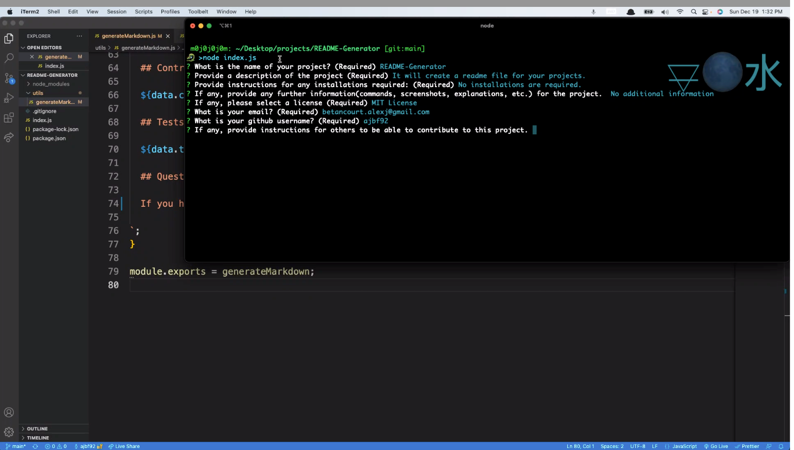
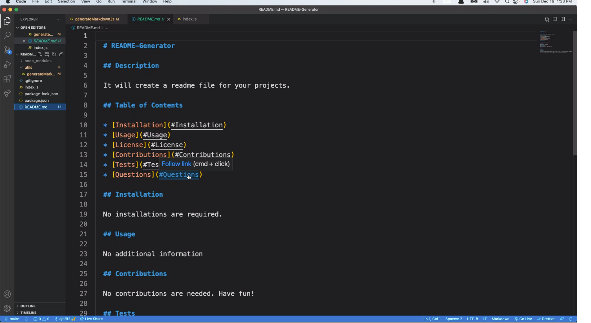

  # README-Generator

  ## Purpose

  To create a readme file for any and all future projects.

  ## Table of Contents

  * [Installation](#Installation)
  * [Usage](#Usage)
  * [Contributions](#Contributions)
  * [Questions](#Questions)

  ## Installation

  No installations are required. Only need to clone repo to local storage and initiate with "node index.js" on the terminal at the root of the file. 

  ## Usage
  
  Terminal example:
  
  
  Readme Example:
  
  
  Walkthrough video:
  https://watch.screencastify.com/v/bPTLm0LwpINYbKsBSmuH
  
  ## Contributions

  By: Alex Betancourt

  ## Questions

  If you have any questions about the repo, open an issue, or contact me directly at betancourt.alexj@gmail.com. Also, you can find more of my work on github: https://github.com/ajbf92.
